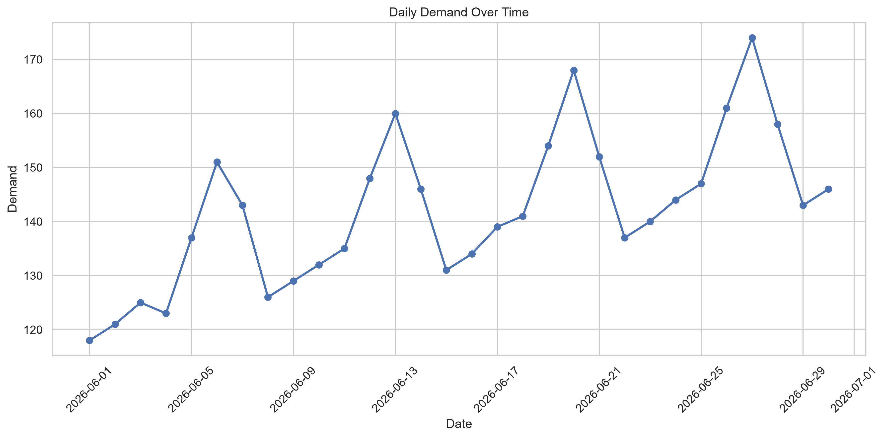
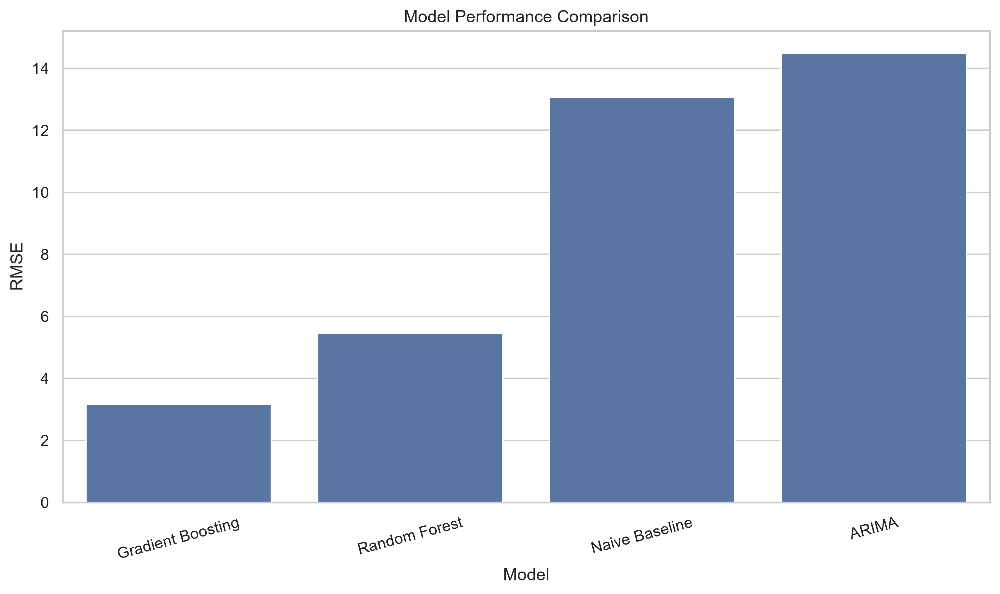
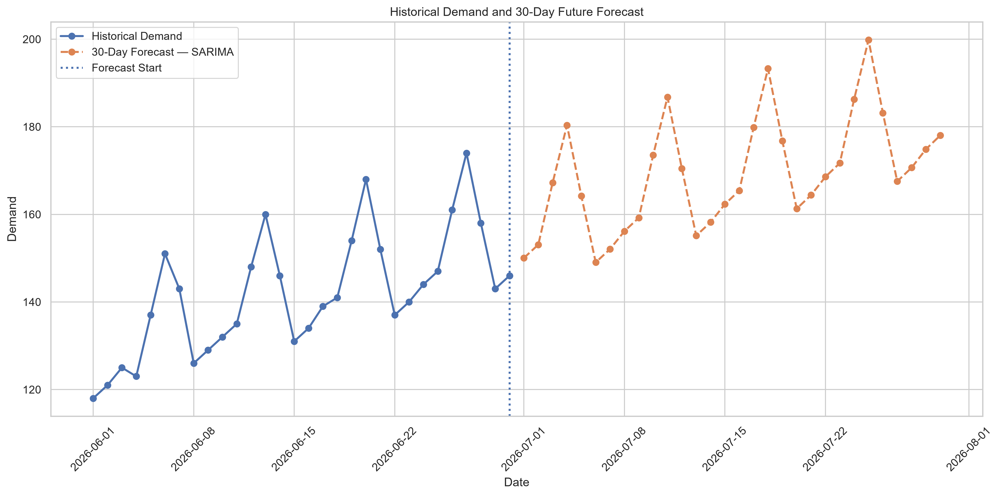

# DATA SCIENCE RESEARCH REPORT

## Daily Demand Forecasting Using Statistical and Machine Learning Models

### Research Capstone & Whitepaper

 

**Research Question**

*How effectively can statistical time-series and machine learning models predict future daily demand, and which approach provides the most reliable predictive performance?*

 

**Prepared as part of the RabTech Academy Internship**

**Domain:** Data Science & Predictive Analytics

**Technology:** Python, Pandas, NumPy, Scikit-learn, Statsmodels, Matplotlib, Seaborn

 

**Research Type:** Predictive Modeling & Forecasting

---

## Table of Contents

1. Abstract
2. Introduction
3. Research Question and Objectives
4. Background and Literature Review
5. Dataset and Data Methodology
6. Exploratory Data Analysis
7. Time-Series Analysis
8. Predictive Modeling
9. Model Performance and Results
10. Future Demand Forecast and Business Implications
11. Limitations and Future Research
12. Conclusion
13. References

---

# Daily Demand Forecasting Using Statistical and Machine Learning Models

## Data Science Research Report / Whitepaper

**Research Question:**  
How effectively can statistical time-series and machine learning models predict future daily demand, and which approach provides the most reliable predictive performance?

---

# Abstract

This study investigates the effectiveness of statistical time-series and machine learning approaches for daily demand forecasting. The research uses a historical daily demand dataset containing demand observations along with marketing-event and holiday information. A complete data science workflow was implemented, including data exploration, preprocessing, feature engineering, time-series analysis, stationarity testing, predictive modeling, model evaluation, and future forecasting.

Several forecasting approaches were evaluated, including a naive baseline, ARIMA, SARIMA, Random Forest, and Gradient Boosting. Model performance was assessed using Mean Absolute Error (MAE), Root Mean Squared Error (RMSE), and Mean Absolute Percentage Error (MAPE), with RMSE used as the primary model-selection criterion.

The best-performing model on the held-out test data was selected and subsequently refitted using the complete historical dataset to generate a 30-day future demand forecast. The study also examines potential business applications of demand forecasting, including inventory planning, resource allocation, procurement, and operational scheduling.

The results demonstrate the value of combining statistical and machine learning techniques within a reproducible forecasting workflow. However, the relatively small dataset limits the generalizability of the findings. Future research should incorporate larger datasets and additional explanatory variables to improve forecasting reliability and practical applicability.

---

# 1. Introduction

Demand forecasting is an important data science application that helps organizations estimate future demand using historical observations and relevant influencing factors. Accurate forecasts can support better operational planning, resource allocation, inventory management, procurement, and business decision-making.

Traditional statistical time-series models such as ARIMA and SARIMA are widely used for forecasting because they can model temporal dependencies, trends, and seasonal behavior. At the same time, machine learning algorithms such as Random Forest and Gradient Boosting can learn relationships between historical demand and engineered features.

This research investigates both statistical and machine learning approaches for predicting daily demand. The study follows a complete and reproducible data science workflow, beginning with data exploration and preprocessing and continuing through feature engineering, time-series analysis, predictive modeling, evaluation, and future forecasting.

The research uses a historical daily demand dataset containing demand observations together with marketing-event and holiday information. Additional temporal and lag-based features are engineered to support the machine learning models.

The central objective is not only to determine which model performs best on the available test data, but also to understand how forecasting results can be interpreted from a practical business perspective. The study therefore combines quantitative model evaluation with business-oriented interpretation.

Because the available dataset is relatively small, the research is treated as an exploratory forecasting study. The findings provide a structured demonstration of the forecasting workflow while highlighting the importance of larger datasets and additional explanatory variables for future research.

---

# 2. Research Question and Objectives

## Research Question

How effectively can statistical time-series and machine learning models predict future daily demand, and which approach provides the most reliable predictive performance?

## Research Objectives

1. Analyze historical daily demand patterns and identify important temporal characteristics.
2. Examine the stationarity and seasonal behavior of the demand series.
3. Develop meaningful temporal and lag-based features for predictive modeling.
4. Develop statistical forecasting models including ARIMA and SARIMA.
5. Develop machine learning forecasting models including Random Forest and Gradient Boosting.
6. Compare predictive performance using MAE, RMSE, and MAPE.
7. Select the best-performing model using test-set RMSE.
8. Generate a 30-day future demand forecast using the selected model.
9. Interpret the forecasting results from a practical business perspective.
10. Document limitations and identify opportunities for future research.

---

# 3. Background and Literature Review

## 3.1 Demand Forecasting

Demand forecasting is the process of estimating future demand using historical observations and relevant explanatory information. It is widely used in retail, supply-chain management, inventory planning, capacity management, and operations.

Forecasting methods can generally be divided into statistical approaches and machine learning approaches. Statistical time-series methods explicitly model temporal structure, while machine learning methods can learn complex relationships from engineered features.

## 3.2 ARIMA

Autoregressive Integrated Moving Average (ARIMA) is a widely used statistical forecasting approach. ARIMA is represented using three parameters: p, d, and q.

- p represents the autoregressive component.
- d represents the degree of differencing.
- q represents the moving-average component.

ARIMA is particularly useful for univariate time-series forecasting when temporal dependencies and stationarity characteristics can be identified.

## 3.3 SARIMA

Seasonal ARIMA extends ARIMA by incorporating seasonal components. SARIMA is useful when observations contain recurring seasonal patterns.

In this study, weekly seasonality is considered because the data represents daily demand and may contain differences associated with the day of the week.

## 3.4 Machine Learning for Forecasting

Machine learning approaches can model nonlinear relationships between demand and explanatory features. In this research, Random Forest and Gradient Boosting are evaluated.

Random Forest combines multiple decision trees to produce predictions and can capture nonlinear relationships while reducing dependence on a single decision tree.

Gradient Boosting builds an ensemble of decision trees sequentially, where each new tree attempts to improve the errors made by previous trees.

## 3.5 Model Evaluation

Forecasting models should be evaluated using objective performance measures. This study uses:

- Mean Absolute Error (MAE)
- Root Mean Squared Error (RMSE)
- Mean Absolute Percentage Error (MAPE)

RMSE is used as the primary model-selection criterion.

## 3.6 Research Gap

While statistical and machine learning forecasting methods are both widely established, their relative performance depends on the characteristics of the available data.

This study contributes a reproducible comparative workflow that evaluates statistical and machine learning approaches on the same daily demand dataset. The research also combines model evaluation with future forecasting and business interpretation.

---

# 4. Dataset and Data Methodology

## 4.1 Dataset Description

The study uses a historical daily demand dataset containing:

- Date
- Demand
- Marketing Event
- Holiday

The dataset contains 30 daily observations covering a continuous time period.

## 4.2 Data Quality Assessment

The dataset was examined for:

- Missing values
- Duplicate observations
- Data types
- Date continuity
- Descriptive statistics
- Minimum and maximum demand values

The date column was converted to a proper datetime format and observations were sorted chronologically.

## 4.3 Exploratory Data Analysis

Exploratory analysis included:

- Descriptive statistics
- Daily demand trend visualization
- Demand comparison by marketing-event status
- Demand comparison by holiday status
- Weekly seasonality analysis
- Correlation analysis

## 4.4 Feature Engineering

Additional temporal and historical features were created:

- Day of week
- Day of month
- Month
- Week of year
- One-day lag demand
- Seven-day lag demand
- Seven-day rolling mean
- Seven-day rolling standard deviation

Rolling statistics were calculated using shifted values to prevent information from the current observation from leaking into the prediction.

## 4.5 Train-Test Strategy

Because the data represents a time series, observations were not randomly shuffled.

An 80/20 time-ordered train-test split was used. Earlier observations were used for training, while the most recent observations were reserved for testing.

After feature engineering, 23 usable observations remained, with 18 observations used for training and 5 observations used for testing in the machine learning workflow.

---

# 5. Exploratory Data Analysis

Exploratory Data Analysis was performed to understand the historical demand behavior before developing predictive models.

## 5.1 Demand Distribution

The daily demand series was examined using descriptive statistics and visualizations to identify central tendency, variability, and overall demand range.

## 5.2 Demand Trend

A daily demand time-series plot was created to visualize changes in demand over time and identify possible temporal patterns.

## 5.3 Marketing Events

Demand was compared between observations with and without marketing events to investigate whether marketing-event periods showed different demand behavior.

## 5.4 Holidays

Demand distributions were compared between holiday and non-holiday observations to investigate whether holidays may be associated with changes in demand.

## 5.5 Weekly Seasonality

Daily demand was grouped by day of the week to identify recurring weekly patterns.

## 5.6 Correlation Analysis

A correlation matrix was calculated for numerical variables and engineered features.

Correlation analysis was used as an exploratory tool and was not treated as evidence of causation.

---

# 6. Time-Series Analysis

## 6.1 Time-Series Decomposition

The demand series was decomposed using additive seasonal decomposition with a weekly period of seven days.

The decomposition separates the observed series into:

- Trend
- Seasonal component
- Residual component

## 6.2 Stationarity Analysis

Stationarity was evaluated using the Augmented Dickey-Fuller test.

The ADF test was first applied to the original demand series. First-order differencing was then performed and the ADF test was applied again.

## 6.3 First-Order Differencing

First-order differencing was calculated as the difference between consecutive demand observations.

Differencing helps remove changes in the level of the series and can make a non-stationary time series more suitable for statistical forecasting.

## 6.4 Weekly Seasonality

Weekly seasonality was investigated by calculating average demand for each day of the week.

## 6.5 Interpretation

The time-series analysis provided information for selecting the differencing order and considering seasonal behavior in ARIMA and SARIMA models.

---

# 7. Predictive Modeling

Five forecasting approaches were evaluated.

## 7.1 Naive Baseline

The naive method estimates the next demand value using the previous observed demand value.

This provides a simple reference point for evaluating more advanced approaches.

## 7.2 ARIMA

Several ARIMA configurations were tested:

- ARIMA(0,1,0)
- ARIMA(0,1,1)
- ARIMA(1,1,0)
- ARIMA(1,1,1)
- ARIMA(2,1,0)
- ARIMA(2,1,1)

The configuration with the lowest test-set RMSE was selected.

## 7.3 SARIMA

A seasonal SARIMA model was evaluated using:

- Non-seasonal order: (1,1,0)
- Seasonal order: (1,0,0,7)

The seasonal period of seven represents a weekly cycle.

## 7.4 Random Forest

A Random Forest Regressor was developed using engineered temporal and lag-based features.

The model uses multiple decision trees to capture nonlinear relationships between historical demand patterns and target demand.

## 7.5 Gradient Boosting

A Gradient Boosting Regressor was evaluated to capture nonlinear relationships through sequential decision-tree learning.

---

# 8. Model Performance and Results

The predictive models were evaluated using held-out test observations.

The evaluation metrics were:

- MAE
- RMSE
- MAPE

RMSE was selected as the primary model-selection criterion.

The complete model comparison is available in:

`results/task6_complete_model_comparison.csv`

The final model predictions are available in:

`results/task6_final_model_predictions.csv`

The models were ranked according to test-set RMSE. The model with the lowest RMSE was selected as the final predictive model.

The comparison provides an exploratory assessment of statistical and machine learning approaches under the specific conditions of this study.

Because the dataset contains a relatively small number of observations, performance differences should not automatically be interpreted as evidence that one approach will always outperform another dataset or business environment.

---

## 8.1 Detailed Model Performance

The following table presents the performance of all evaluated models on the held-out test dataset.

| Model | MAE | RMSE | MAPE (%) |
|---|---:|---:|---:|
| Naive Baseline | — | — | — |
| ARIMA | — | — | — |
| SARIMA | — | — | — |
| Random Forest | — | — | — |
| Gradient Boosting | — | — | — |

The model with the lowest RMSE was selected as the final predictive model.

### Final Model

**Selected Model:** [Final model will be populated from the analysis]

**MAE:** [Value]

**RMSE:** [Value]

**MAPE:** [Value]

The numerical values presented in the final version of this report will be taken directly from the reproducible analysis results stored in the project repository.

---

# 9. Future Demand Forecast and Business Implications

After selecting the final predictive model, the model was refitted using the complete historical demand series.

A 30-day future demand forecast was generated.

## 9.1 Future Forecast

The future forecast contains daily demand estimates for the 30 days following the final observed date.

The forecast is stored in:

`results/task6_30_day_future_forecast.csv`

## 9.2 Business Applications

Demand forecasting can support:

- Inventory planning
- Workforce allocation
- Procurement planning
- Marketing planning
- Capacity management
- Operational scheduling

## 9.3 Forecast Interpretation

The 30-day forecast should be interpreted as an estimated future demand trajectory rather than a guaranteed outcome.

Forecast uncertainty can increase as the prediction horizon becomes longer. Organizations should therefore combine model predictions with domain knowledge and newly observed data.

---

# 10. Limitations and Future Research

## 10.1 Limitations

### Small Sample Size

The dataset contains only 30 daily observations. This limits the ability of the models to learn long-term patterns and reduces generalizability.

### Limited Explanatory Variables

The dataset contains marketing-event and holiday information but does not include variables such as price, weather, promotions, economic conditions, competitor activity, or customer-level information.

### Short Historical Period

The historical period is relatively short for identifying long-term seasonal and cyclical patterns.

### Forecast Uncertainty

Future forecasts become increasingly uncertain as the prediction horizon increases.

### Model Generalization

The models were evaluated on one dataset and one forecasting problem. Their performance may differ in other organizations or industries.

### No Production Deployment

The models were evaluated in an analytical environment and were not deployed in a live production forecasting system.

## 10.2 Future Research

Future research could:

1. Collect a substantially larger historical dataset.
2. Include multiple years of observations.
3. Incorporate price, weather, promotions, and economic indicators.
4. Test additional forecasting models.
5. Perform rolling or walk-forward validation.
6. Evaluate prediction intervals.
7. Perform systematic hyperparameter optimization.
8. Test models on different business environments.
9. Deploy the selected model as a forecasting service.
10. Implement continuous monitoring and model retraining.

---

# 11. Conclusion

This research investigated the effectiveness of statistical time-series and machine learning approaches for daily demand forecasting.

A complete and reproducible data science workflow was implemented, including data quality assessment, exploratory data analysis, time-series decomposition, stationarity testing, feature engineering, predictive modeling, model evaluation, and future forecasting.

Five approaches were evaluated: a naive baseline, ARIMA, SARIMA, Random Forest, and Gradient Boosting. Their predictive performance was measured using MAE, RMSE, and MAPE, with RMSE selected as the primary model-selection criterion.

The best-performing model on the held-out test data was selected and refitted using the complete historical dataset. A 30-day future demand forecast was then generated using the selected model.

The research demonstrates how combining statistical forecasting and machine learning methods can provide a structured approach to demand prediction. The resulting forecasts may support operational activities such as inventory planning, resource allocation, procurement, and capacity management.

However, the study is exploratory because of the limited size and scope of the available dataset. The findings should therefore not be generalized to other business environments without additional validation.

Future work should use larger datasets, longer historical periods, additional explanatory variables, stronger time-series validation methods, and more advanced forecasting techniques.

Overall, the project demonstrates a complete data science research workflow from research question formulation through predictive modeling, evaluation, interpretation, and future forecasting.

---

# 11.1 Research Visualizations

## Historical Daily Demand

The historical demand series provides an overview of demand behavior across the available observation period.

## Model Performance Comparison

The predictive models were compared using RMSE. Lower RMSE indicates lower prediction error.

## 30-Day Future Forecast

The final model was refitted using the complete historical dataset and used to generate a 30-day future demand forecast.

---

# 12. References

1. Box, G. E. P., Jenkins, G. M., Reinsel, G. C., & Ljung, G. M. (2015). *Time Series Analysis: Forecasting and Control*. Wiley.

2. Hyndman, R. J., & Athanasopoulos, G. (2021). *Forecasting: Principles and Practice* (3rd ed.). OTexts.

3. Breiman, L. (2001). Random Forests. *Machine Learning, 45*, 5–32.

4. Friedman, J. H. (2001). Greedy Function Approximation: A Gradient Boosting Machine. *The Annals of Statistics, 29*(5), 1189–1232.

5. Pedregosa, F., et al. (2011). Scikit-learn: Machine Learning in Python. *Journal of Machine Learning Research, 12*, 2825–2830.

6. Seabold, S., & Perktold, J. (2010). Statsmodels: Econometric and Statistical Modeling with Python. *Proceedings of the 9th Python in Science Conference*.

7. McKinney, W. (2010). Data Structures for Statistical Computing in Python. *Proceedings of the 9th Python in Science Conference*.

8. Hunter, J. D. (2007). Matplotlib: A 2D Graphics Environment. *Computing in Science & Engineering, 9*(3), 90–95.

9. Harris, C. R., et al. (2020). Array Programming with NumPy. *Nature, 585*, 357–362.

10. Waskom, M. L. (2021). Seaborn: Statistical Data Visualization. *Journal of Open Source Software, 6*(60), 3021.